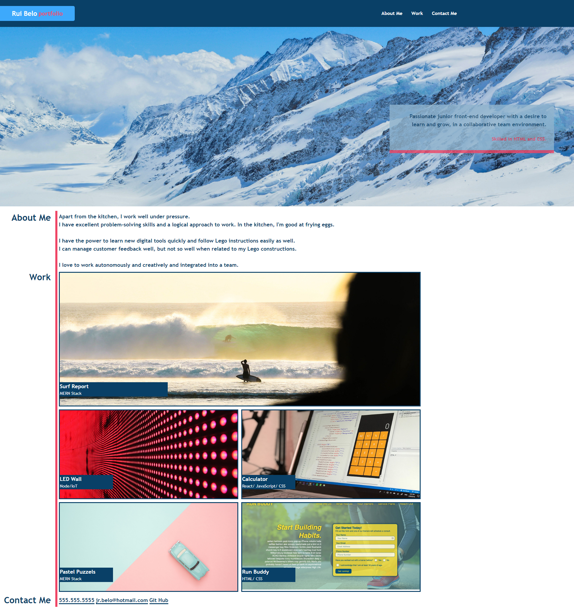

# Edx-Bootcamp-Portfolio

## Table of Contents

* [The repository](#repository)
* [Project description](#description)
* [Mock-Up](#mock-Up)
* [Contributing](#contributing)
* [Links](#links)
* [Credits](#credits)
* [License](#license)

### Repository

Bootcamp - Portfolio.  
An organized and effective way to show the projects that Rui Belo has been involved in this Bootcamp.

### Description

The Bootcamp Portfolio website is divided into six elements:

**Header**  
Includes a navigation bar with the brand name on the left and a link pointing to the Home Page, and on the right side are the **About Me**, **Work**, and **Contact Me** links pointing to the respective sections on the website.

**Section Bio Box**  
Right after the top bar, there is the "Snowy mountains with blue sky" image, which occupies the entire navigation element.  
And it has a floating bio box with a paragraph and a callout.

**Section About Me**  
A block text where some of the skills are highlighted.

**Section Work**  
Section where will be published the most recent projects.

**Section Contact Me**  
Here is where the contacts are found.

### Mock-Up

The image below illustrates the Bootcamp Portfolio web page appearance:  

### Contributing

Why you should contribute to an open-source project?  
Contributing to open-source is a rewarding way to learn, teach, and build experience in just about any skill.
You don’t have to contribute code, there’s always a task for you on an open-source project.
Besides coding, you can contribute to user interface design, graphic design, writing, or organizing.

Ways you can contribute:

* [Submit bugs and feature requests](https://github.com/CZ-RBelo/Edx-Bootcamp-Portfolio/issues)
* [Review source code changes](https://github.com/CZ-RBelo/Edx-Bootcamp-Portfolio/pulls)

> **Spell check errors**  
>Pull requests that fix spell-check errors are welcomed.  
>If you want to give feedback or report an issue, please create a [new GitHub issue](https://github.com/CZ-RBelo/Edx-Bootcamp-Portfolio/issues/new).  
>**Please check if a topic about your issue already exists!**

### Links

* [Github Repository](https://github.com/CZ-RBelo/Edx-Bootcamp-Portfolio.git)
* [Deployed Application](https://cz-rbelo.github.io/Edx-Bootcamp-Portfolio/)
* [Project Task List](https://github.com/CZ-RBelo/Edx-Bootcamp-Portfolio/issues/1)

### Credits

[Bio Box Background Photo by Gotta Be Worth It](https://www.pexels.com/photo/snowy-mountains-under-blue-sky-in-winter-5210453/)

### Contacts

If you require any further information, feel free to contact me at:
 
* Github Profile: [CZ-RBELO](https://github.com/CZ-RBelo/)  
* Email: [jr.belo@hotmail.com](mailto:jr.belo@hotmail.com)
* LinkedIn: [Rui Belo](https://linkedin.com/in/ruibelo)

---
### License
Licensed under the [MIT license](/LICENSE)